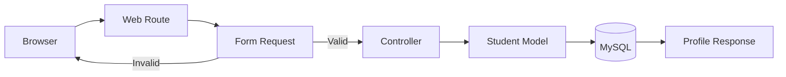
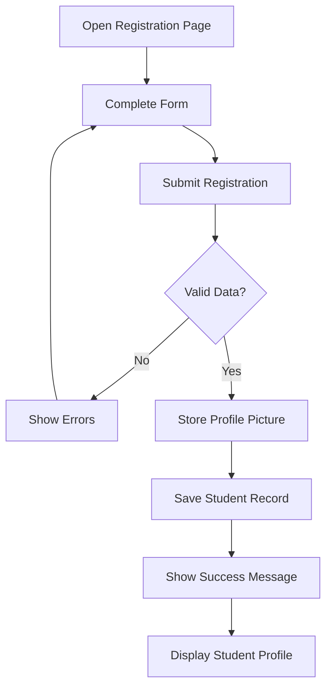
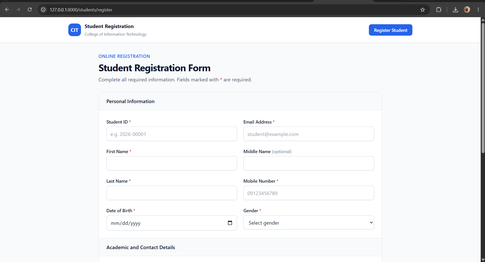
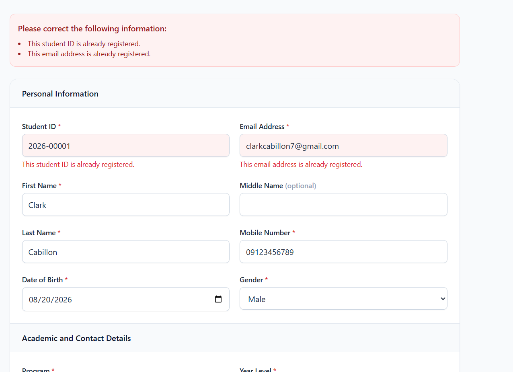
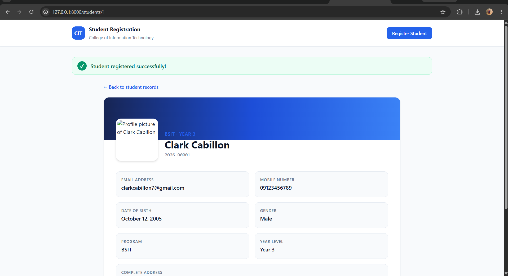
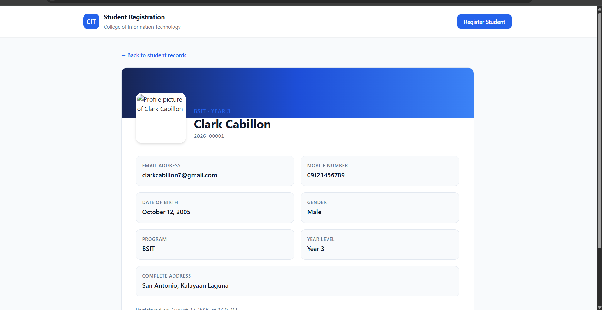
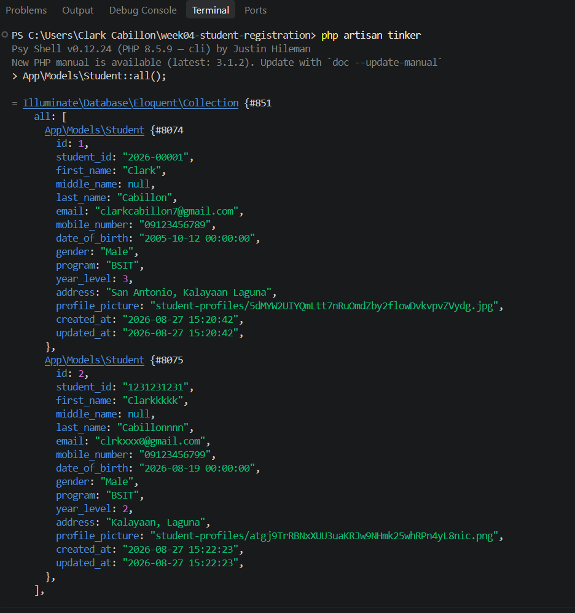
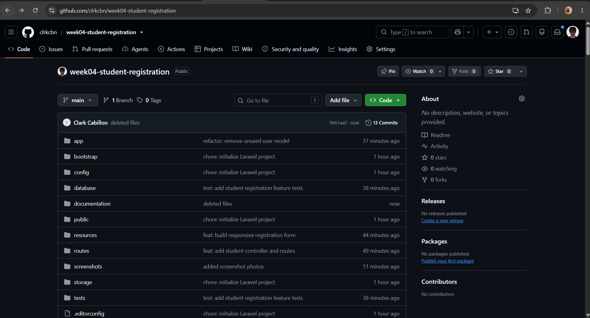
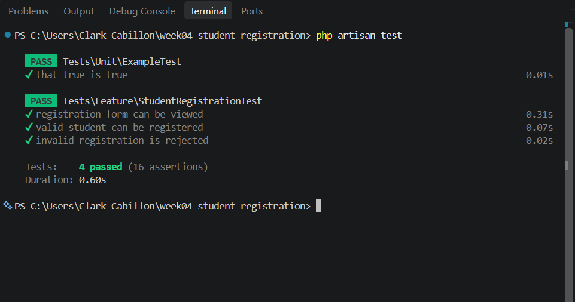
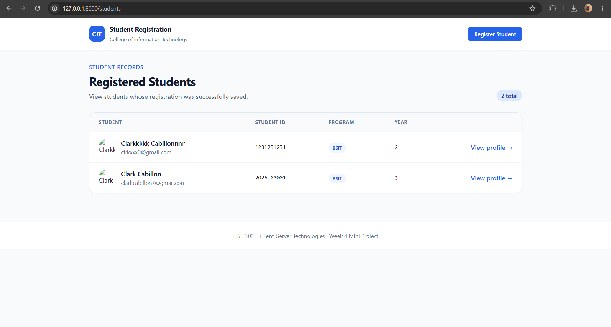

# Student Registration System

Week 4 Mini Project for **ITST 302 – Client-Server Technologies**. This Laravel application replaces paper-based registration with a validated online form, secure profile-picture upload, MySQL record storage, flash notifications, a student list, and an individual profile page.

## Features

- Responsive Blade registration form styled with Tailwind CSS
- Server-side validation using a dedicated Form Request
- Unique Student ID and email constraints
- JPG/JPEG/PNG profile upload with a 2 MB limit
- Images stored on Laravel's public storage disk
- Success flash message and field-level validation feedback
- Paginated student directory and profile details page
- Automated feature tests for successful and invalid submissions

## Objectives

After completing this project, the student should be able to:

1. Build a professional registration form using Laravel Blade.
2. Route browser requests to the correct controller methods.
3. validate user input on the server before storing it.
4. show field-specific errors and session-based success messages.
5. upload and display images through Laravel Storage.
6. design a relational MySQL table with appropriate constraints.
7. explain Laravel's request lifecycle from browser to response.
8. maintain and document the application through Git and Markdown.

## Requirements

- PHP 8.2 or newer
- Composer 2
- MySQL 8 or MariaDB
- PHP extensions required by Laravel, including Fileinfo and PDO MySQL

## Installation

```bash
git clone YOUR_REPOSITORY_URL
cd week04-student-registration
composer install
cp .env.example .env
php artisan key:generate
```

Create a MySQL database named `student_registration`, then update the `DB_*` values in `.env`. Continue with:

```bash
php artisan migrate
php artisan storage:link
php artisan serve
```

Open `http://127.0.0.1:8000`. To run automated checks:

```bash
php artisan test
```

If you use Windows PowerShell, replace `cp .env.example .env` with `Copy-Item .env.example .env`.

## Laravel Request Lifecycle

The browser submits the form to the named POST route. Laravel creates `StoreStudentRequest`, checks the validation rules, and redirects back with errors if any value is invalid. When the data is valid, `StudentController@store` saves the uploaded picture, creates the database record through the `Student` model, and redirects to the profile page with a success flash message.



## Validation Rules

| Field | Rules | Purpose |
|---|---|---|
| Student ID | required, string, max 30, unique | Prevents missing and duplicate institutional IDs |
| Names | required/nullable, string, max 100 | Ensures safe and reasonable text input |
| Email | required, valid RFC/DNS email, unique | Rejects invalid and duplicate addresses |
| Mobile number | required, 10–15 digits | Accepts numeric phone data without losing a leading zero |
| Date of birth | required, date, before today | Rejects missing or future dates |
| Gender | required, allowed values only | Prevents unexpected values |
| Program | required, allowed program codes | Keeps academic data consistent |
| Year level | required, integer, 1–4 | Restricts the value to supported year levels |
| Address | required, string, max 500 | Requires a usable address and limits its length |
| Profile picture | required image, JPG/JPEG/PNG, max 2 MB | Reduces unsafe file types and oversized uploads |

Validation is enforced both by Laravel and by unique indexes in MySQL for important identifiers.

## Database Design

The system currently contains one main entity. `id` is the primary key, while `student_id` and `email` have unique constraints.

```mermaid
erDiagram
    STUDENTS {
        bigint id PK
        varchar student_id UK
        varchar first_name
        varchar middle_name NULL
        varchar last_name
        varchar email UK
        varchar mobile_number
        date date_of_birth
        enum gender
        enum program
        tinyint year_level
        text address
        varchar profile_picture
        timestamp created_at
        timestamp updated_at
    }
```

## Registration Flowchart



## Main Project Structure

```text
app/Http/Controllers/StudentController.php
app/Http/Requests/StoreStudentRequest.php
app/Models/Student.php
database/migrations/*_create_students_table.php
resources/views/layouts/app.blade.php
resources/views/students/{index,create,show}.blade.php
routes/web.php
tests/Feature/StudentRegistrationTest.php
documentation/
screenshots/
```

## Problems Encountered and Solutions

1. **Validation errors did not appear beside the correct fields.** The form now checks Laravel's `$errors` bag with `@error` for every input and also displays an error summary.
2. **Uploaded images were unavailable in the browser.** Pictures are saved on the `public` disk, their relative paths are stored in MySQL, and `php artisan storage:link` exposes them through `public/storage`.
3. **Phone numbers could lose the first zero when stored as numbers.** The database uses a `varchar` column while validation requires 10–15 digits. This preserves the original number safely.


## Screenshots

 
 
 
 
 
 
 
 


## Documentation

- [Reflection](documentation/reflection.md)
- [Laravel request lifecycle diagram](documentation/request-lifecycle.svg)
- [Database ERD](documentation/database-erd.svg)
- [Registration flowchart](documentation/registration-flowchart.svg)

## References

Laravel. (n.d.). *Laravel documentation*. https://laravel.com/docs

MDN Web Docs. (n.d.). *Client-side form validation*. https://developer.mozilla.org/en-US/docs/Learn_web_development/Extensions/Forms/Form_validation

Oracle. (n.d.). *MySQL 8.4 reference manual*. https://dev.mysql.com/doc/refman/8.4/en/

PHP Documentation Group. (n.d.). *PHP manual*. https://www.php.net/manual/en/

Tailwind Labs. (n.d.). *Tailwind CSS documentation*. https://tailwindcss.com/docs

## License

This project is for educational use.
